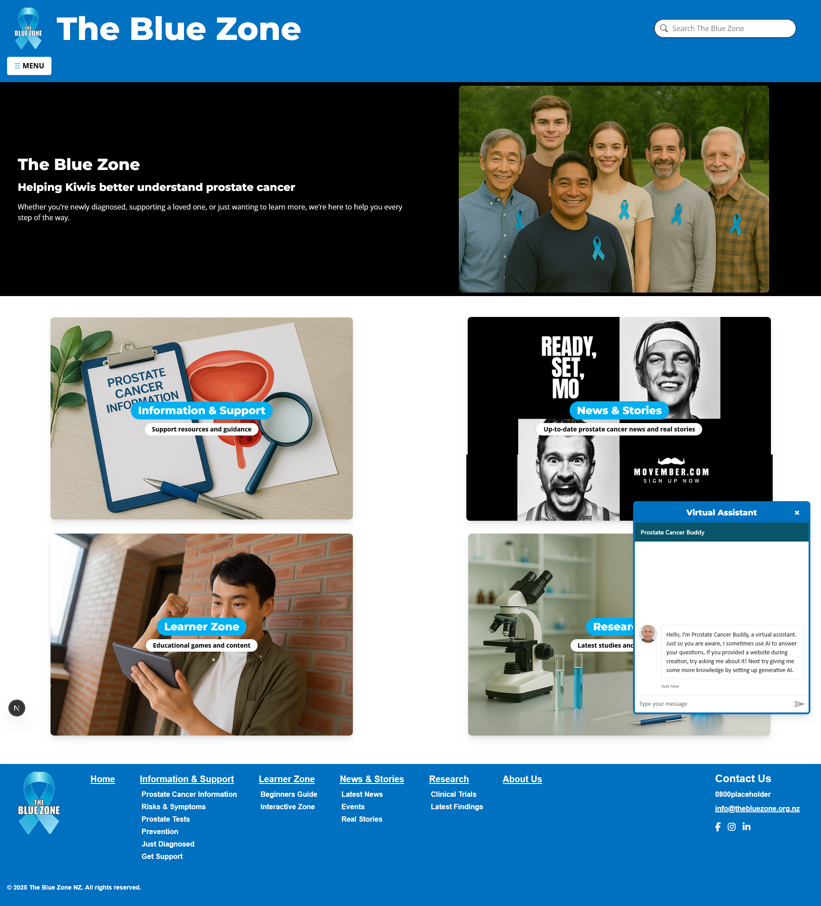

# The Blue Zone 

A prostate awareness website built in Next.js (Currently still a work in progress)

---

## Features

- Responsive web design
- Gamification

---

## How to Run

1. Open in Visual Studio
2. `npm install`
3. `npm run dev`
4. http://localhost:3000